<div align="center">

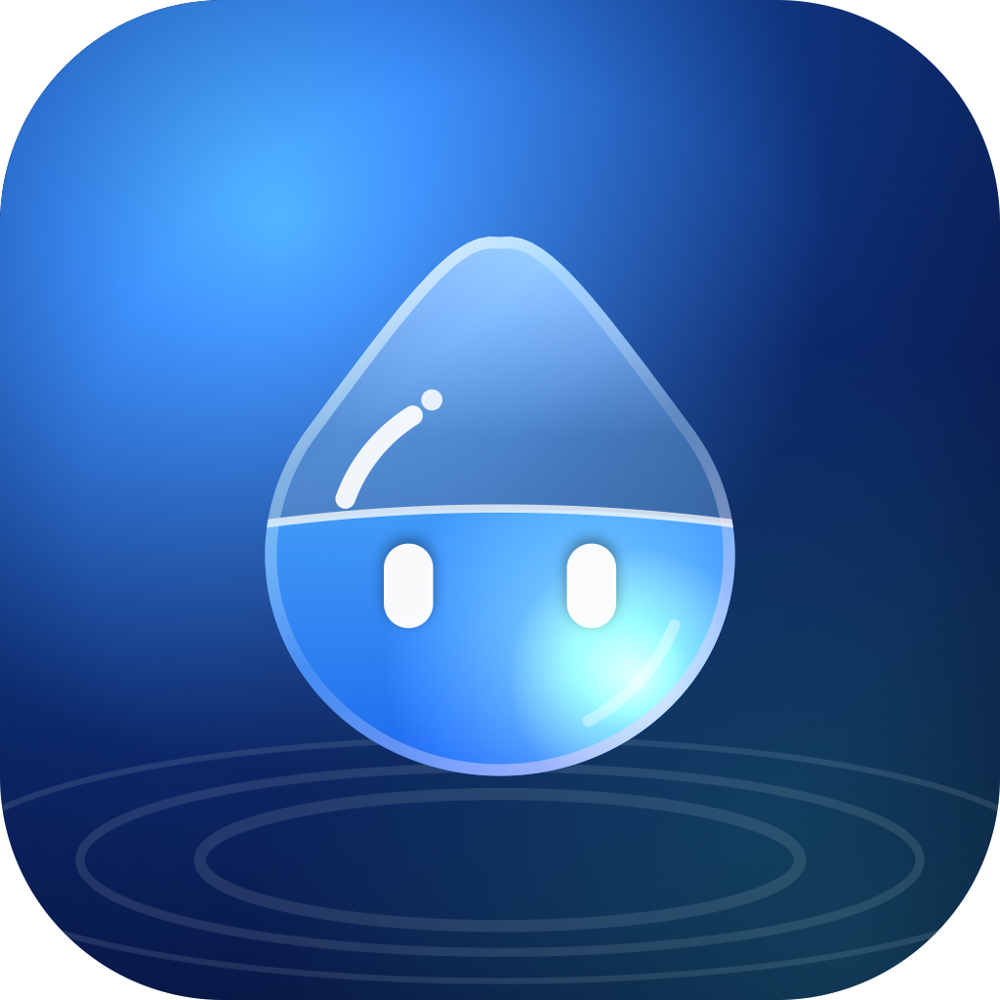

# Dewdrop

**A drop of Liquid Glass in your Mac's notch that keeps an eye on your Claude Code sessions — and costs about 1 % of a core while it does.**

Approve permissions, watch your agents work, jump to the right terminal, drop a file, ask Claude a question, control your music, set a timer — without leaving what you're doing.


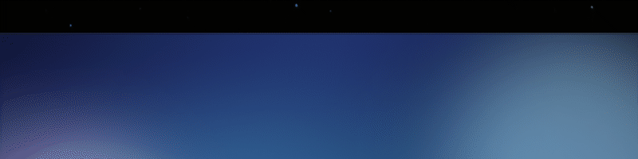

</div>

---

## Meet Dew

Dew is a bead of the island's own glass. In the open island its body is **real Liquid Glass** (`glassEffect`, not a blurred rectangle): it bends whatever is behind it, and inside it holds a little liquid that takes the colour of what Claude is doing — clear when idle, blue while working, amber when something needs you, green when it's done. Move the island and the liquid sloshes; leave it alone and it settles.

<div align="center">
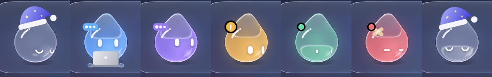
<br><sub>idle · working · thinking · needs approval · finished · error · sleeping (at night Dew wears a nightcap)</sub>
</div>

Dew blinks, breathes, follows your pointer with its eyes, waves hello when the app starts, puts on headphones when music plays, a scarf when it snows, sunglasses when it's bright, and turns into a glass box to swallow a file you drop on the notch.

<div align="center">
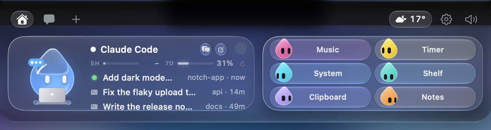
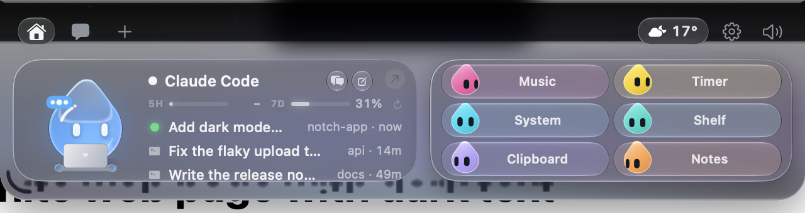
<br><sub>The island is glass too: the same view over a dark wallpaper and over a white page.</sub>
</div>

## What it does

- 🤖 **Every Claude Code session, live** — in any terminal (Terminal, iTerm, Ghostty, Warp, VS Code, Cursor…), not only VS Code. See what each session reads, edits and runs; the dot breathes while it's busy.
- ✅ **Approve from the notch** — permission requests arrive with **Allow / Deny**. One click, back to work. The island never answers on its own.
- 🧑‍💻 **Jump to the right terminal** — click a session and the exact window and tab comes to the front; a finished session can be resumed in a new one.
- 💬 **Ask Claude anything** — chat straight from the notch through the Claude Code CLI, so it uses your subscription; no API key needed (an API key works too).
- 📊 **Claude hub** — your 5-hour and weekly usage, recent sessions and shortcuts to the Claude apps, in the session card.
- 🎵 ⏱️ 💻 📎 📋 📝 **Live-activity pills** — Music (with artwork and a scrubber), Timer, System (CPU, memory, battery, thermal), Shelf (files you dropped), Clipboard history and Notes, each with its own small coloured Dew. Track changes and timers show as compact Dynamic-Island banners when the island is folded.
- 📎 **Drop a file on the notch** — Dew becomes a glass box and swallows it; then ask a question about it, send it by email or keep it on the shelf.
- 🪟 **Drag Dew onto a window** — attach that window as context for your question.
- 🌦️ **Weather** — in the header, with the next hours in a card. Dew opens an umbrella when it rains.
- ☕ **Keep awake** — stop the Mac from sleeping from the island.
- 🔌 **Integrations** — Stripe, n8n, GitHub, Vercel, Resend, Notion, Cal.com, each as a pill ([docs/INTEGRATIONS.md](docs/INTEGRATIONS.md)); any agent can get its own pill by tagging its hook payload ([docs/AGENTS.md](docs/AGENTS.md)).
- 🫥 **Out of the way** — folded into the notch when there's nothing to say; opens on hover or click, closes when you click elsewhere or press Escape.
- 🖥️ **Any Mac** — on a Mac without a notch (or with the lid closed) the island sits in a small bar at the top of the screen.
- 🔒 **Private by design** — no telemetry, no account. Keys live in the macOS Keychain. The app talks only to the services you plug in.

<table>
<tr>
<td>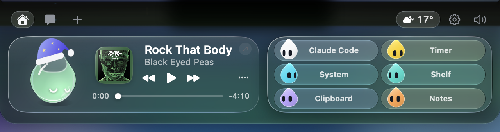</td>
<td>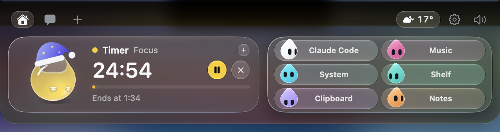</td>
</tr>
<tr>
<td>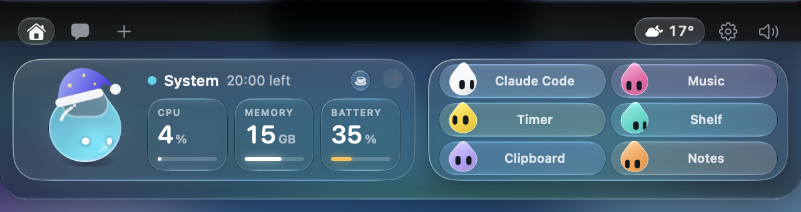</td>
<td>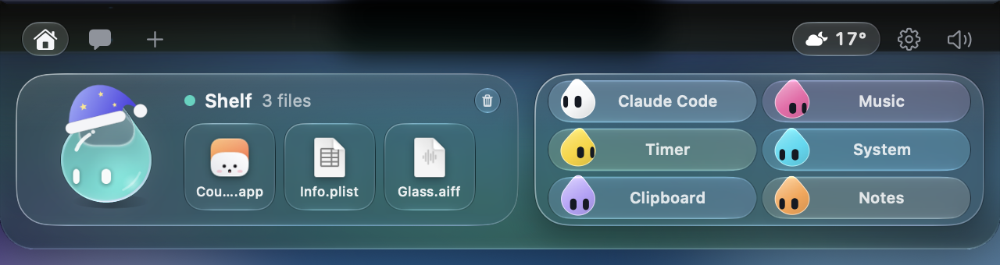</td>
</tr>
<tr>
<td>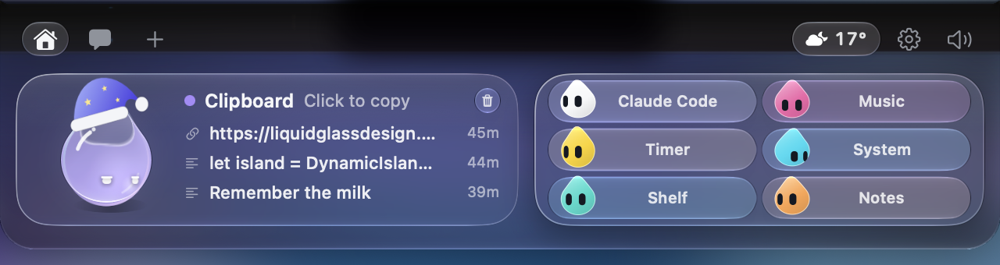</td>
<td>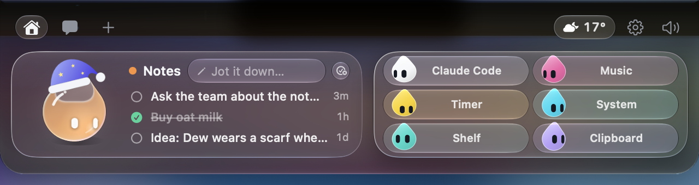</td>
</tr>
<tr>
<td>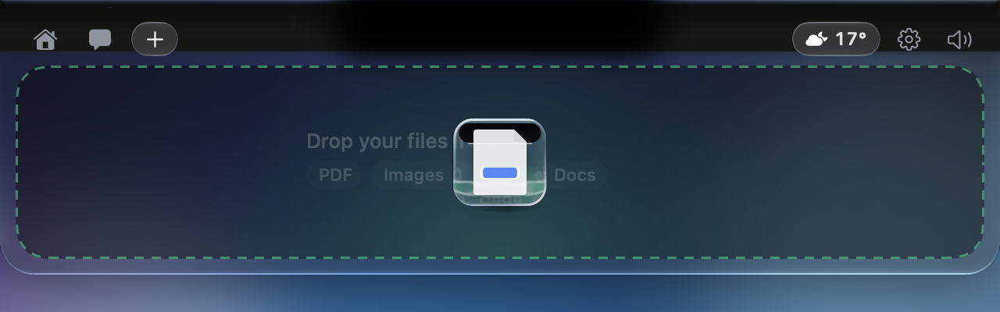</td>
<td>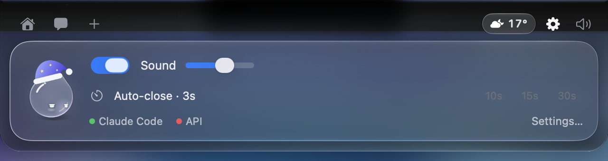</td>
</tr>
</table>

<div align="center">
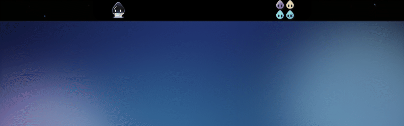<br>
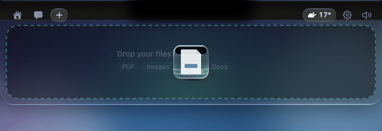
</div>

## Efficient by design

A notch companion is on screen all day, so it has to be nearly free. Dewdrop is built around one number: **how many times a second the island is redrawn**. Every redraw of a SwiftUI window costs a few milliseconds whatever changed, so the design keeps that number at zero whenever nothing moves.

<div align="center">
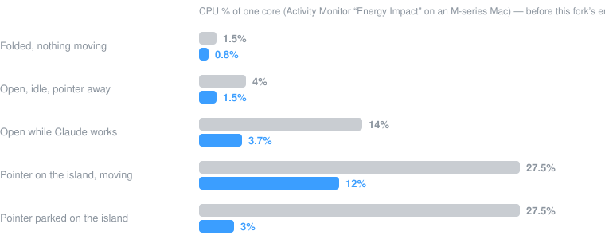
</div>

| Situation | CPU (one core) | What is running |
|---|---|---|
| Folded, nobody touching the Mac | **~1 %** | a blink now and then; one pointer check a second |
| Open, idle, pointer away | **1–2 %** | Dew breathing; 10 pointer checks a second |
| Open while Claude works | **3–4 %** | the badge's three dots at 6 fps |
| Pointer on the island, moving | **10–13 %** | everything alive at 30 fps |
| Pointer parked on the island | **~3 %** after 5 s | the animations settle until it moves |

How it gets there — the long version with the measurements is in [docs/ENERGY.md](docs/ENERGY.md):

- **Only the visible view exists.** The island's sixteen views are not kept alive at opacity 0; the one you see is the only one in the tree.
- **Nothing ticks for nothing.** Dew's canvas is event-driven: it draws while something changes and stops the moment it settles. A slow heartbeat asks whether a blink is due.
- **No `TimelineView` for ambient motion.** While a SwiftUI timeline has an entry coming, the window keeps a display link running and renders on every screen refresh between entries — a badge ticking 6 times a second cost 226 render passes a second. Every repeating animation here uses one shared timer (`Beat`) on one clock grid, so all of them land in the same redraw and nothing happens in between.
- **Two tiers of motion.** Breathing, dancing, the pill characters, the colour drift and text shimmer run only while the pointer is on the island (and settle after five seconds if it's parked there). Things that must move all day — the music equalizer, pulsing dots — are Core Animation layers, which cost the app nothing.
- **A pointer that doesn't move isn't polled.** Hover detection polls at 20–60 Hz only while the mouse is moving; when it stops, a mouse-moved monitor takes over and the app goes quiet. Global click and key monitors exist only while the island is open.
- **Measured, not assumed.** `-debugFrames 1` logs every five seconds how many render passes the window made and why (`pass=`, `poll=`, `heartbeat=`, which part of Dew was animating). Each change above was judged by that line and by `top`.

## Install

There is no release yet (see [Status](#status)). Build from source:

**Requirements:** macOS 15+ (Liquid Glass needs macOS 26; on 15 Dew is drawn in plain canvas), Xcode 16+, [XcodeGen](https://github.com/yonaskolb/XcodeGen).

```bash
brew install xcodegen
git clone git@github.com:MGALIKE/dewdrop.git
cd dewdrop/NotchBuddy
xcodegen
xcodebuild -scheme NotchBuddy -configuration Release -derivedDataPath build build
cp -R build/Build/Products/Release/Dewdrop.app /Applications/
open /Applications/Dewdrop.app
```

## Setup

Click the icon in the menu bar → **Settings…**

| What | Why | Where it goes |
|---|---|---|
| **Claude Code hooks** | live sessions and approvals | **Install hooks** — the app backs up `~/.claude/settings.json`, merges its hooks and shows you the diff before writing anything |
| **Claude Code CLI** | chat on your subscription | found automatically (`claude` on your PATH) |
| **Anthropic API key** | chat without the CLI, questions about files | Keychain, optional |
| **Gemini CLI / Antigravity hooks** | their sessions in the island | **Install hooks** in Settings |
| Stripe, n8n, GitHub, Vercel, Resend, Notion, Cal.com | integration pills | Keychain, all optional |

If the app isn't running, the hook exits immediately: **Claude Code is never blocked.**

## Things to try

| Do this | Dew does that |
|---|---|
| Hover the notch | the island opens |
| Hover Dew | blinks, eyes grow |
| Click Dew | squish + annoyed; three fast clicks and it's dizzy |
| Leave the pointer on it | after a few seconds everything settles, like a drop at rest |
| Drag a file onto the island | turns into a glass box and swallows it |
| Drag Dew onto a window | attaches it as context |
| Play music | puts on headphones; the track change slides out of the notch |
| Start a timer | a small countdown ring sits beside the notch |
| Plug in the charger | a short "charging" banner, and a zap |

## Under the hood

- **Island:** a borderless `NSPanel` hugging the notch, driven by a small state machine (`hidden → petit → home`). The body is `glassEffect` on macOS 26 with a drifting mesh of the current state's colour behind it.
- **Dew:** two SwiftUI `Canvas` layers with real glass between them (`DewBody.swift`, `BotEngine.swift`). The lower canvas draws the hands and the liquid, the glass bends it, the upper canvas adds the light in the drop, the eyes, the badge and the props. Pose, blinks, looks and emotes come from a 60-step-per-second engine that only runs while something moves. Beside the folded notch and in the pills, Dew is canvas-only (there is only black to bend there).
- **Claude Code:** a tiny `nb-hook` script receives hook events and forwards them over a Unix socket to the app. For approvals it waits for your click, then answers the hook. Sessions are matched to their terminal by TTY so the island can jump to the right tab.
- **Chat:** through the `claude` CLI (`-p`, streaming JSON), so it uses your plan; usage numbers come from the same stream.
- **Monitors:** music via the players' distributed notifications (no polling), timers and system stats on slow timers that run only when their pill is on, weather every 30 minutes.
- **Sounds:** 28 short WAVs — plips, bubbles, drops and small glass bells, synthesised from a script (`design/sounds/make.py`) — through preloaded `AVAudioPlayer`s.

Native Swift 6 / SwiftUI / AppKit, strict concurrency, **zero third-party dependencies**.

### Debug launch arguments

Every screenshot and GIF in this README was taken with these (Debug builds only), over a temporary test wallpaper, with nothing touching the mouse:

```
-debugView overview|prompt|settings   open a view      -debugState working|approval|finished|…   force Dew's state
-debugFocus integration_music|timer|…  open a card      -debugProps "headphones,mug,party,laptop"  dress Dew
-debugSamples 1   sample sessions, shelf, clips, notes  -debugUpload 1 [-debugDrop 1]              drop zone (+ the drop)
-debugLively 1    animate as if the pointer were on it  -debugBounce 1                             open/close on a loop, logs frame times
-debugFrames 1    log render passes and why, every 5 s  -debugDewGlass 0                           Dew without the real glass
-debugWeather rain|sun|snow   -debugTimer 600   -debugPower charge|low   -debugHUD volume   -debugClaude finished|needs
```

Logs go to `~/Library/Logs/NotchBuddy/nb.log`.

## Status

This is a fork of [Coucou](https://github.com/Louis-CFM/coucou) that grew its own character and a different idea of what the island should cost. The rename is done: name, character, icon, sounds and bundle identifier (`com.mgalike.dewdrop`) are Dewdrop's own; settings from a previous Coucou install are carried over on first launch, the hooks keep working, and macOS asks again once for the Automation and Accessibility permissions. There is no signed release yet. The upstream Windows port is not part of this fork.

What is different from upstream, in short: sessions from any terminal (not only VS Code) and a jump back to their tab · chat on your Claude subscription through the CLI · the live-activity pills (Music, Timer, System, Shelf, Clipboard, Notes), Dynamic-Island banners and the Claude hub · Liquid Glass styling of the island and a glass character · the energy work above (folded 12–15 % → ~1 %, open ~50 % → 1–13 %).

## Credits & licence

Dewdrop started as a fork of **Coucou** by [Louis Raillé](https://louisraille.fr), who had the idea of an open notch companion for Claude Code and built most of what you see here — the island, the hooks, the integrations, the sounds and the Mochi character this one replaced. Thank you.

- **Code:** [MIT](LICENSE) — the original copyright notice is kept, as the licence asks.
- **The names "Coucou" and "Mochi", the Mochi character, the original icon, sounds and media** are © Louis Raillé, all rights reserved ([LICENSE-ASSETS.md](LICENSE-ASSETS.md)) and are no longer in this repository.
- **Dew, the Dewdrop icon, the sounds and the images here** are this fork's own and come under the same MIT licence as the code.

Built with [Claude Code](https://claude.com/claude-code).
